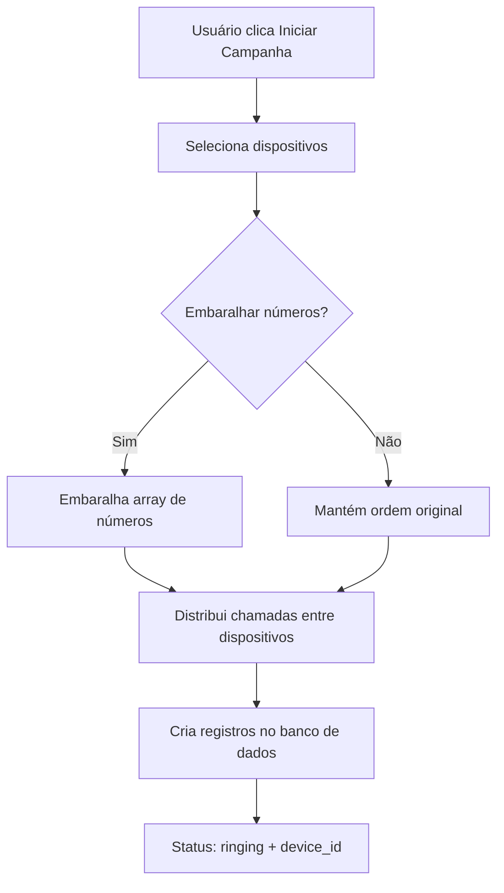
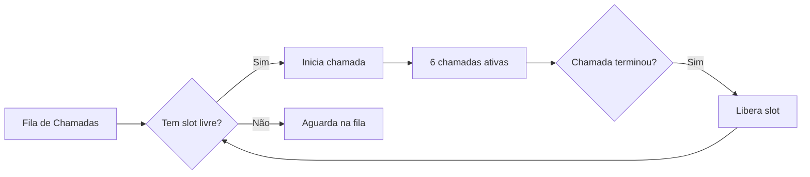

# Fluxo de Campanhas - PBX Mobile

## Visão Geral

O sistema de campanhas permite iniciar chamadas em massa a partir do **Dashboard Web**, que são automaticamente processadas pelos **dispositivos móveis** com sistema de fila inteligente.

---

## Fluxo Completo

### 1. **Dashboard Web - Iniciar Campanha**

#### Localização
- Aba **"Listas"** no Dashboard
- Botão **"Iniciar Campanha"** em cada lista

#### Processo


#### Código Relevante
**Arquivo**: `src/components/PBXDashboard.tsx`

```typescript
const handleStartCampaign = async (listId: string, deviceIds: string[], shuffle: boolean) => {
  const list = lists.find(l => l.id === listId);
  
  let numbers = [...list.numbers];
  
  // Embaralha se configurado
  if (shuffle) {
    for (let i = numbers.length - 1; i > 0; i--) {
      const j = Math.floor(Math.random() * (i + 1));
      [numbers[i], numbers[j]] = [numbers[j], numbers[i]];
    }
  }

  // Distribui entre dispositivos
  for (let i = 0; i < numbers.length; i++) {
    const deviceId = deviceIds[i % deviceIds.length];
    await addCall(numbers[i], deviceId);
  }
}
```

**Dados inseridos no banco**:
```sql
INSERT INTO calls (user_id, device_id, number, status, start_time)
VALUES (
  'user-uuid',
  'device-uuid',  -- Dispositivo atribuído
  '+5511999999999',
  'ringing',
  NOW()
);
```

---

### 2. **App Mobile - Escuta Chamadas**

#### Sistema de Real-time
O app mobile escuta automaticamente novas chamadas atribuídas a ele usando Supabase Realtime.

**Hook**: `src/hooks/useCallAssignments.ts`

```typescript
useCallAssignments({
  deviceId: 'device-uuid',
  enabled: isPaired && hasDialerRole,
  onNewCall: (number, callId) => {
    // Adiciona à fila automaticamente
    addToQueue({ number, callId });
  }
});
```

#### Como funciona
1. **Subscription no banco de dados**:
   - Escuta eventos `INSERT` na tabela `calls`
   - Filtrado por `device_id = deviceId`
   
2. **Ao detectar nova chamada**:
   - Adiciona número à fila
   - Mantém referência do ID do banco

3. **Evita duplicatas**:
   - Mantém registro de chamadas já processadas
   - Ignora chamadas já vistas

---

### 3. **Sistema de Fila (6 Chamadas Simultâneas)**

#### Hook: `src/hooks/useCallQueue.ts`

#### Funcionamento



#### Regras
- **Máximo**: 6 chamadas simultâneas por dispositivo
- **Reposição automática**: Quando uma chamada termina, a próxima da fila inicia
- **Prioridade**: FIFO (First In, First Out)

#### Código
```typescript
const processQueue = async () => {
  const availableSlots = 6 - activeCalls.size;
  const callsToMake = queue.slice(0, availableSlots);
  
  for (const queuedCall of callsToMake) {
    // Inicia chamada via plugin nativo
    const result = await PbxMobile.startCall({ 
      number: queuedCall.number 
    });
    
    // Mapeia ID nativo para ID do banco
    activeCalls.set(result.callId, queuedCall.callId);
  }
};
```

---

### 4. **Sincronização de Status**

#### Quando chamada muda de estado

```typescript
PbxMobile.addListener('callStateChanged', async (event) => {
  // event.state: 'dialing' | 'ringing' | 'active' | 'disconnected'
  
  // Atualiza banco de dados
  await supabase
    .from('calls')
    .update({ status: mapStatus(event.state) })
    .eq('id', dbCallId);
  
  // Se terminou, remove da fila ativa
  if (event.state === 'disconnected') {
    removeFromActive(event.callId);
    // Automaticamente processa próxima da fila
  }
});
```

#### Mapeamento de Status
- `dialing` → `ringing`
- `ringing` → `ringing`
- `active` → `answered`
- `disconnected` → `ended`

---

## Interface Visual

### Dashboard Web

#### Aba "Chamadas"
- Mostra **todas** as chamadas (ativas e finalizadas)
- Dados vêm do banco de dados em tempo real
- Status atualizado automaticamente

#### Aba "Listas"
- Botão "Iniciar Campanha"
- Opções:
  - ✅ Selecionar dispositivos
  - ✅ Embaralhar números
  - ✅ Prefixo DDI (opcional)

### App Mobile

#### Status da Fila
```
┌──────────────────────────────┐
│ Status de Chamadas           │
├──────────────────────────────┤
│ Ativas:  4/6    Fila: 12     │
│ [████████░░]                 │
│ [Limpar Fila]                │
└──────────────────────────────┘
```

- **Ativas**: Chamadas em andamento
- **Fila**: Chamadas aguardando
- **Barra de progresso**: Visual das 6 slots
- **Botão "Limpar Fila"**: Remove pendentes

---

## Exemplo Prático

### Cenário: Campanha com 50 números em 2 dispositivos

1. **Usuário no Dashboard**:
   - Vai em "Listas" → "Clientes 2025"
   - Clica "Iniciar Campanha"
   - Seleciona "Celular 1" e "Celular 2"
   - Marca opção "Embaralhar"
   - Clica "Iniciar"

2. **Sistema embaralha**:
   ```javascript
   Original: [111, 222, 333, 444, ...]
   Embaralhado: [444, 111, 333, 222, ...]
   ```

3. **Distribui entre dispositivos**:
   - Número 1 → Celular 1
   - Número 2 → Celular 2
   - Número 3 → Celular 1
   - Número 4 → Celular 2
   - ... (alternando)

4. **Celular 1 recebe 25 chamadas**:
   - Inicia 6 imediatamente
   - 19 ficam na fila
   - À medida que chamadas terminam, próximas iniciam

5. **Celular 2 recebe 25 chamadas**:
   - Mesmo processo

6. **Dashboard atualiza em tempo real**:
   - Mostra status de cada chamada
   - Contador de chamadas ativas
   - Histórico de chamadas finalizadas

---

## Monitoramento

### Dashboard
- **Aba "Dispositivos"**: Status de cada aparelho
- **Aba "Chamadas"**: Log completo de todas as chamadas
- **Estatísticas**: Chamadas hoje, dispositivos online, etc.

### App Mobile
- **Tela de Status**: Fila e chamadas ativas
- **Logs do Sistema**: Console mostra eventos em tempo real

### Banco de Dados
```sql
-- Ver chamadas ativas por dispositivo
SELECT 
  d.name as device_name,
  COUNT(*) as active_calls
FROM calls c
JOIN devices d ON c.device_id = d.id
WHERE c.status IN ('ringing', 'answered')
GROUP BY d.name;

-- Ver fila de chamadas por dispositivo
SELECT 
  d.name,
  c.number,
  c.status,
  c.start_time
FROM calls c
JOIN devices d ON c.device_id = d.id
WHERE c.status = 'ringing'
ORDER BY c.start_time;
```

---

## Troubleshooting

### Problema: Chamadas não iniciam no app

**Solução**:
1. Verificar se app tem permissões concedidas
2. Confirmar que é discador padrão (ROLE_DIALER)
3. Checar logs: `adb logcat | grep PbxMobile`
4. Verificar conexão com Supabase

### Problema: Fila não processa

**Solução**:
1. Verificar listener `callStateChanged` está ativo
2. Confirmar que `removeFromActive` está sendo chamado
3. Checar se há erros no console

### Problema: Dados não aparecem no dashboard

**Solução**:
1. Verificar RLS policies do banco
2. Confirmar que `user_id` está correto nas chamadas
3. Verificar subscription real-time

---

## Performance

### Otimizações Implementadas
- ✅ Fila automática evita sobrecarga
- ✅ Limite de 6 chamadas por dispositivo
- ✅ Real-time apenas para dados relevantes
- ✅ Batch insert no banco quando possível
- ✅ Mapeamento eficiente de IDs em memória

### Métricas Recomendadas
- **Tempo médio de chamada**: 30-120 segundos
- **Taxa de sucesso**: > 70%
- **Chamadas por hora (por device)**: ~120-180
- **Latência de sincronização**: < 1 segundo

---

## Segurança

### RLS Policies
```sql
-- Usuários só veem suas próprias chamadas
CREATE POLICY "Users can view their own calls"
ON calls FOR SELECT
USING (auth.uid() = user_id);

-- Dispositivos só podem atualizar suas chamadas
CREATE POLICY "Devices can update their calls"
ON calls FOR UPDATE
USING (auth.uid() = user_id);
```

### Validações
- ✅ Device ID validado antes de atribuir chamada
- ✅ User ID sempre preenchido
- ✅ Status transitions controladas
- ✅ Duplicatas evitadas no app

---

## Logs Úteis

### App Mobile
```typescript
console.log('New call assigned:', { number, callId });
console.log('Call started:', { nativeId, dbId });
console.log('Call ended:', { callId, duration });
console.log('Queue status:', getQueueStatus());
```

### Dashboard
```typescript
console.log('Campaign started:', { listId, devices, shuffle });
console.log('Call created:', { number, deviceId, callId });
```

---

## Próximos Passos

### Melhorias Futuras
- [ ] Pausar/retomar campanha
- [ ] Priorizar números importantes
- [ ] Retry automático para falhas
- [ ] Relatórios de campanha
- [ ] Agendamento de campanhas
- [ ] Gravação de chamadas
- [ ] Integração com CRM

---

**Última atualização**: $(date)
**Versão do Sistema**: 2.0
**Compatibilidade**: Android 10+ (API 29+)
